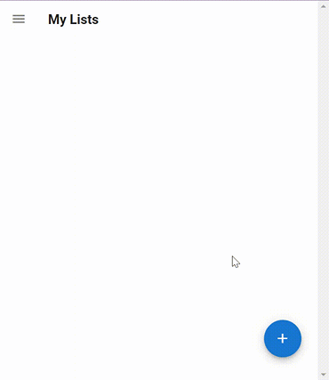
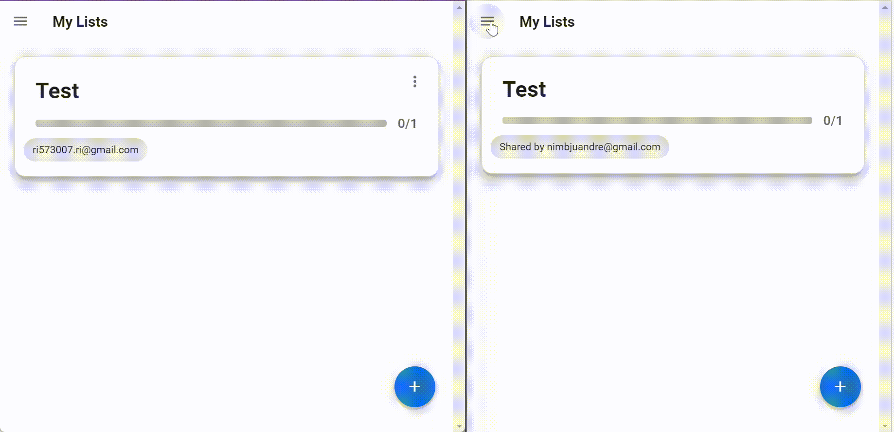

# ShopperBuddy

 Create and share shopping lists with your buddy
 
 
 
## Share your list with your buddy



## Firebase Setup

ShopperBuddy uses Firebase for authentication, database and hosting. Create your app on firebase and replace the environment keys with your configuration setting.

```js
// .env
VUE_APP_APIKEY = "xxxxxxxxxxxxxxxxxxxxxxxxxxxxxxxxxxxxxxxxxxxxxxxxxxx"
VUE_APP_AUTHDOMAIN = "xxxxxxxxxxxxxxxxxxxxxxxxxxxxxxxxxxxxxxxxxxxxxxx"
VUE_APP_DATABASEURL = "xxxxxxxxxxxxxxxxxxxxxxxxxxxxxxxxxxxxxxxxxxxxxx"
VUE_APP_PROJECTID = "xxxxxxxxxxxxxxxxxxxxxxxxxxxxxxxxxxxxxxxxxxxxxxxx"
VUE_APP_STORAGEBUCKET = "xxxxxxxxxxxxxxxxxxxxxxxxxxxxxxxxxxxxxxxxxxxx"
VUE_APP_MESSAGINGSENDERID = "xxxxxxxxxxxxxxxxxxxxxxxxxxxxxxxxxxxxxxxx"
VUE_APP_APPID = "xxxxxxxxxxxxxxxxxxxxxxxxxxxxxxxxxxxxxxxxxxxxxxxxxxxx"
```

## Build Setup

``` bash
# install dependencies
npm install
# serve with hot reload at localhost:8080
npm run serve
# build for production with minification
npm run build
# deploy on Firebase
npm run deploy
```
